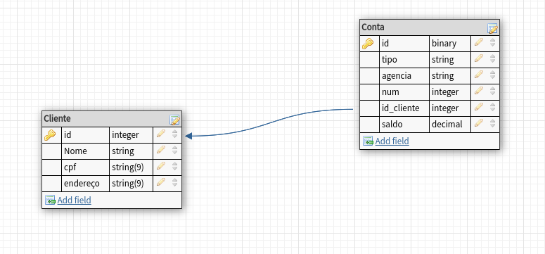
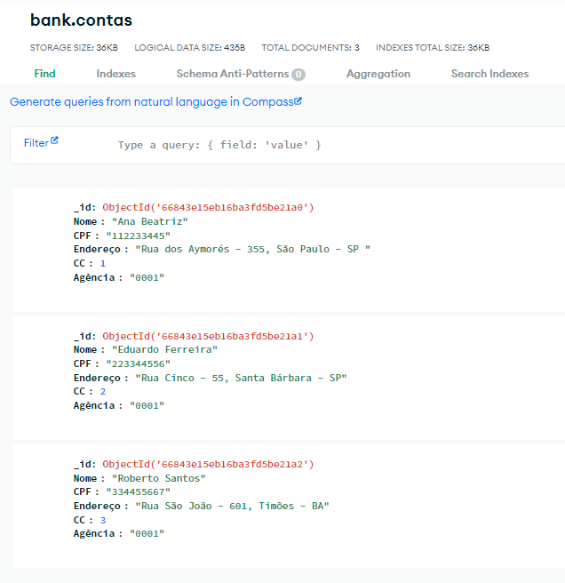

# **Desafio de Projeto**

## **Integração Python com SQLite e MongoDB**
Conteúdo: Aplicação de conceitos de ORM e utilização de Frameworks e bibliotecas como SqlAlchemy, SQLite e Pymongo

Linguagem: Python

----
### **Objetivo Geral**
Fazer a integração de uma aplicação implementada em python com os bancos de dados SQLite e MongoDB.

----
**Parte I**

**Implementando um Banco de Dados Relacional com SQLAlchemy**

- Implementar uma aplicação de integração com SQLite com base em um esquema relacional disponibilizado.
- Utilizar o esquema dentro do contexto de cliente e conta para criar as classes da API. Essas classes irão representar as tabelas do banco de dados relacional dentro da aplicação.

- **Modelo Relacional**

----
**Parte II**

**Implementando um Banco de Dados NoSQL com Pymongo**

- Implementar um banco NoSQL com MongoDB para fornecer uma visão agregada do modelo relacional utilizando o Pymongo.

- Conectar ao MongoDB e criar um banco de dados para armazenar os documentos.

- Definir uma coleção "Bank" para criar e armazenar os documetos de clientes

- As informações de clientes e contas existentes deverão ficar contidas dentro de documentos extraídos das tabelas do modelo relacional.

- **MongoDB Screenshot**

